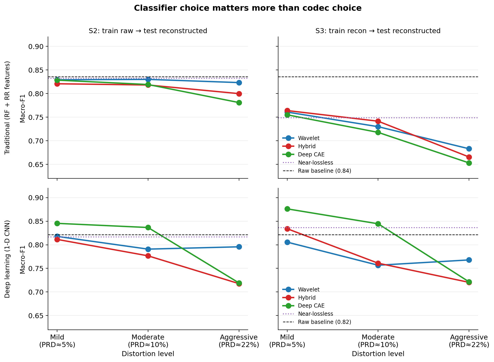
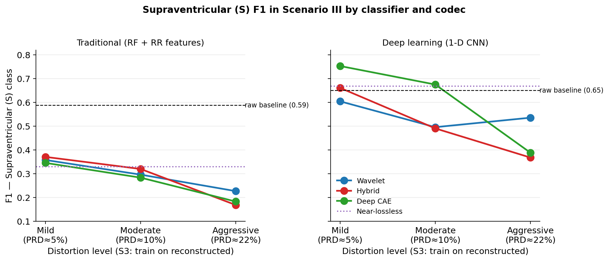
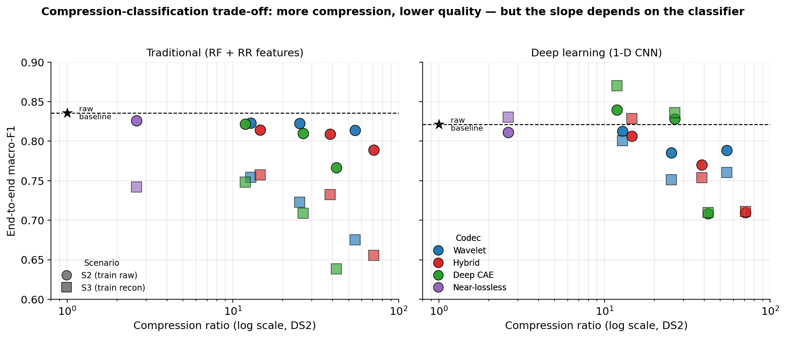
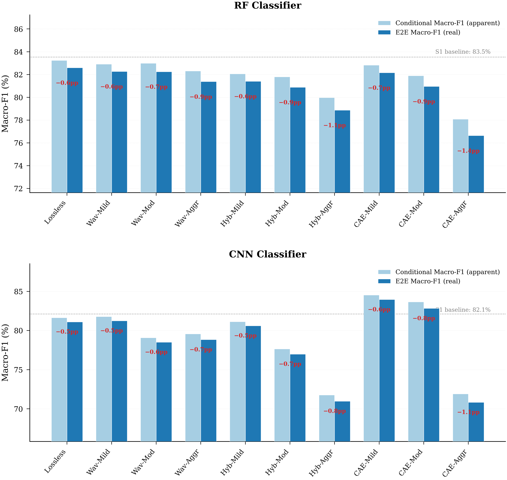

# ECG Compression–Classification Benchmark

Benchmarking how ECG compression affects downstream arrhythmia classification in realistic telemedicine workflows.

---

## Project Overview

This repository presents an ongoing research project investigating how different ECG compression techniques affect downstream arrhythmia classification performance in a realistic end-to-end telemedicine workflow.

ECG signal compression is widely used to reduce storage and transmission costs in wearable devices and telemedicine systems. However, most ECG compression studies focus on improving compression metrics (CR, PRD, WEDD) without examining how compressed-reconstructed signals affect downstream classification models. Similarly, most ECG classification studies evaluate on raw signals only. In practice, however, compression and classification are used together.

This project closes that gap by evaluating ECG compression and downstream classification together in a realistic telemedicine-oriented setting: the signal is first compressed, the compressed payload is transmitted or stored, reconstruction occurs on the receiver side, beats are detected from the reconstructed waveform using an automatic QRS detector, and classification is performed on the detected beats.

## Dataset and Evaluation Protocol

Experiments were conducted on the **MIT-BIH Arrhythmia Database** using a modified patient-disjoint inter-patient split derived from the De Chazal protocol. Because PhysioNet indicates that records 201 and 202 originate from the same subject, record 202 was reassigned to the training set to avoid subject overlap between train and test partitions. The same split was used in both the compression and classification experiments.

A **three-class AAMI mapping** was adopted: normal (N), supraventricular ectopic (S), and ventricular ectopic (V) beats. Fusion (F) and unknown (Q) beats were excluded — F because it represents a very small fraction of the dataset, and Q because it predominantly consists of paced rhythms or noise-related artefacts. Strict patient-wise separation was maintained between training and testing sets across all experiments.

## Benchmark Design

**Compression methods (4)**

| Family | Description |
|---|---|
| Near-lossless | Second-order delta-coding with uniform quantisation (q_bits = 11) and buffer-coded entropy reduction |
| Wavelet-based | Two-dimensional discrete wavelet transform with Huffman-coded sparse quantisation |
| Hybrid | DWT + dead-zone quantisation + run-length encoding + zlib entropy coding |
| Deep CAE | Convolutional autoencoder with adaptive decoder selection and symmetric latent quantisation |

**Distortion levels (3 for the lossy methods)**

| Tag | Target PRD |
|---|---|
| MILD | 4–5 |
| MOD  | 9–11 |
| AGGR | 18–20 |

The near-lossless method was evaluated at a single fixed operating point.

For the near-lossless, wavelet-based, and hybrid methods, the quantisation step was tuned per-record on DS1 to achieve each target distortion regime. The DS1 parameters were then frozen and applied uniformly to DS2.

**Classification pipelines (2)**

- **Traditional (RF)** — Random Forest with 800 trees, max depth 20, min leaf 8, fixed class weights of (1.5, 3.0, 1.2) for (N, S, V), and a post-hoc gating rule on supraventricular predictions requiring evidence of prematurity or compensatory pause. Features include RR-interval and local rhythm descriptors, waveform morphology, P-wave features, wavelet-domain features, and correlations with class templates derived from the training data.
- **Deep learning (CNN)** — 1-D CNN operating on beat-centred inputs of shape 128 × 3 (resampled beat waveform plus two RR-derived channels). Three convolutional blocks (32/64/128 filters with kernel sizes 5/3/3), each followed by batch normalisation, ReLU, and max pooling. Global average pooling, dropout 0.3, three-class softmax. Trained with Adam, sparse categorical cross-entropy, batch size 2048, cosine LR decay over 50 epochs, square-root inverse-frequency class weighting.

To isolate model-family behaviour from upstream processing differences, both pipelines share the same inter-patient partition, three-class label space, lead-selection rule, preprocessing (0.5–45 Hz bandpass, resample to 360 Hz, z-normalise on the first 300 s), and beat-extraction policy.

**Evaluation scenarios (3)**

| ID | Train on | Test on | What it measures |
|---|---|---|---|
| **Scenario I** | Raw | Raw | Baseline (gold-standard annotations on both splits) |
| **Scenario II** | Raw (gold) | Reconstructed (XQRS-detected) | Deploying an existing model on compressed data |
| **Scenario III** | Reconstructed (XQRS-detected) | Reconstructed (XQRS-detected) | Retraining to match the deployment domain |

Whenever a reconstructed signal is used, beats are detected with an automatic QRS detector (XQRS) and then matched to gold annotations using a one-to-one greedy algorithm with a 150 ms tolerance. Gold beats with no matching detection are counted as missed.

## Evaluation Metrics

**Compression performance:** CR (ratio of uncompressed-baseline byte size to compressed-payload byte size, including all method-specific side information), PRD (computed between standardised input and reconstructed signal), and WEDD.

**Classification performance:** Macro-F1, F1-S (class-specific F1 for the supraventricular class), Macro-AUC, and **End-to-End Macro-F1 (E2E Macro-F1)**, which treats every missed gold beat as an additional false negative for its true class. E2E Macro-F1 captures the full pipeline cost (detection failures + classification errors) that conventional per-detected-beat metrics hide.

## Selected Results

The two baseline classifiers achieve accuracies within the range reported in prior inter-patient three-class MIT-BIH studies:

- **RF baseline:** accuracy = 95.96%, Macro-F1 = 0.8354, F1-S = 0.5877, Macro-AUC = 0.9742
- **CNN baseline:** accuracy = 95.50%, Macro-F1 = 0.8212, F1-S = 0.6503, Macro-AUC = 0.9760

The RF classifier has a higher overall Macro-F1 in the baseline scenario, but the CNN already outperforms it on the supraventricular class (0.6503 vs 0.5877) before any compression is introduced.

### Figure 1 — Classification quality vs compression distortion

Macro-F1 across the three distortion levels for the two classifiers (rows) and two non-baseline scenarios (columns).

For the **RF classifier** (top row), Macro-F1 in Scenario II remains close to the baseline at lossless and most mild/moderate operating points, with the largest drops appearing only at aggressive levels of the hybrid and deep-learning-based methods. Scenario III is qualitatively different — accuracy diverges rapidly downward across **all** compression methods, including near-lossless. This indicates that the train–test combination using compressed reconstructed signals can have a greater impact on classification accuracy than the degree of compression itself.

For the **CNN classifier** (bottom row), the accuracy metrics fluctuate both upward and downward relative to the baseline. In Scenario III, mild and moderate deep-learning-based compression, near-lossless compression, and hybrid mild compression all *improve* over the baseline accuracy. The CNN, operating directly on the beat waveform, can absorb the distributional shifts introduced by retraining on detector-derived beats by adjusting its learned filters — something the RF classifier, with its hand-crafted features and tuned decision boundary, cannot do.

### Figure 2 — Rare-class (S) performance under retraining (Scenario III)

The S-class vulnerability pattern. In the **RF panel** (left), F1-S in Scenario III collapses dramatically — to as low as **16.8% for hybrid aggressive (CR = 71)** and **18.3% for deep-learning-based aggressive (CR = 42)**. The S-class collapse is disproportionately large relative to the overall Macro-F1 drop at the same operating points.

In the **CNN panel** (right), F1-S holds up much better, and at mild distortion with the deep-learning-based codec the CNN reaches F1-S = 0.7523 — exceeding its own raw-trained baseline of 0.6503 by 10.2 percentage points. This is the largest gap between the two classifiers anywhere in the benchmark.

### Figure 3 — Compression ratio vs end-to-end macro-F1

End-to-end Macro-F1 plotted against the achieved DS2 compression ratio (log scale). At matched PRD ranges, the three lossy codecs produce broadly similar E2E Macro-F1 drops in most conditions. **Two notable exceptions:**

1. The **deep-learning-based codec at mild and moderate levels improves CNN performance** rather than degrading it — an outcome not observed under any other codec.
2. **Aggressive wavelet-based compression** is less harmful to both classifiers at comparable PRD than the other lossy methods at aggressive levels.

These differences indicate that **PRD does not fully characterise the downstream impact of compression** — codec family matters at fixed distortion.

### Figure 4 — Conditional vs end-to-end Macro-F1 in Scenario III

This figure visualises the gap between two ways of measuring the same classifier on the same reconstructed signal, in **Scenario III** (retrain on reconstructed). The light bars show **conditional Macro-F1** — the score the classifier reports on the beats that the QRS detector successfully recovered from the reconstructed signal. The dark bars show **E2E Macro-F1**, which additionally penalises every gold-standard beat that the detector missed by counting it as a false negative for its true class. The dotted line marks the Scenario I (raw) baseline for each classifier; red annotations give the percentage-point drop from conditional to E2E.

Three observations:

1. **The conditional–E2E gap is small but always negative**, ranging from −0.5 to −1.4 percentage points across the 20 conditions shown. The QRS detector misses real beats but the classifier is still doing most of the work — missed-beat penalties do not collapse the metric, they erode it.

2. **The gap widens with distortion.** At mild operating points the gap is ≤0.7 pp; at aggressive operating points it grows to roughly 1.0–1.4 pp. The R-peak detector becomes more error-prone as the reconstructed waveform becomes less faithful, exactly when the classifier is also working hardest. This is the *compounding* effect that per-detected-beat metrics hide.

3. **The CNN–CAE Mild combination is the only operating point that exceeds its own baseline on both metrics.** With deep-learning-based mild compression, the CNN's E2E Macro-F1 (84.0%) sits *above* the 82.1% raw baseline, even after accounting for missed beats. No other (codec, classifier) combination achieves this.

The takeaway is operational: the systematic gap between Macro-F1 and E2E Macro-F1 is small enough that conventional reporting is not catastrophically wrong, but it is large enough at aggressive distortion to matter clinically — and any benchmark that ignores it will overstate the safe operating range of a compression-classification pipeline.

### Key Findings

**RF classifier — fragile under retraining**

- In Scenario II (deploy without retraining), Macro-F1 and E2E Macro-F1 remain near the baseline for lossless compression and across mild/moderate lossy levels. The largest drops appear only at aggressive levels of hybrid and deep-learning-based compression.
- In Scenario III (retrain on reconstructed), accuracy diverges rapidly downward across **all** compression methods — even near-lossless. The training–testing combination on reconstructed signals impacts accuracy more than the degree of compression.
- F1-S in Scenario III collapses to **16.8% for hybrid aggressive** and **18.3% for deep-learning-based aggressive**, compared to the 58.77% baseline.
- During retraining, the beat population shifts to detector-derived locations with slightly altered alignment and morphology, hand-crafted features shift in distribution, and the tuned decision boundary changes — none of which the RF can compensate for.

**CNN classifier — adaptable under retraining**

- In Scenario II, accuracy metrics decrease only slightly relative to baseline for lossless and mild/medium wavelet and hybrid compression. At equivalent levels of deep-learning-based compression, the CNN actually *improves* over the baseline. All aggressive settings degrade accuracy.
- In Scenario III, the CNN improves over the baseline for **deep-learning-based mild and moderate compression, near-lossless, and hybrid mild**. Under deep-learning-based mild compression, the CNN reaches **Macro-F1 = 0.8761** and **F1-S = 0.7523**, exceeding the uncompressed baseline by 5.5 and 10.2 percentage points respectively.
- Aggressive lossy compression still hurts the CNN across all codecs, with the largest drops under aggressive deep-learning-based and aggressive hybrid compression.
- Operating directly on the beat waveform, the CNN absorbs the distributional shifts from retraining on detector-derived beats by adjusting its learned filters.

**Codec selection is classifier-dependent**

- The deep-learning-based CAE compression is the best match for the CNN classifier up to medium compression (PRD ≈ 10).
- For the RF classifier, wavelet-based compression preserves accuracy best across all levels — even at aggressive compression with CR = 54.78 and PRD = 23 — when the model is trained on raw signals and tested on reconstructed signals.
- At matched PRD, codec family still matters: PRD alone does not fully characterise downstream classification impact.

**⚠️ Conventional metrics are misleading under compression**

- Overall accuracy and Macro-F1 hide severe per-class drops on the rare supraventricular (S) class. In several cases the overall Macro-F1 looks intact while the per-class F1-S has collapsed.
- The systematic gap between conditional Macro-F1 and E2E Macro-F1 (Figure 4) is small at mild distortion (≤0.7 pp) but grows to 1.0–1.4 pp at aggressive distortion. Conventional per-detected-beat metrics therefore understate the true cost of compression, and the understatement is largest exactly where the classifier is most stressed.
- Any benchmark of compression–classification interaction should report per-class metrics and end-to-end metrics explicitly, not just aggregated per-detected-beat scores.

## Limitations

- Experiments are conducted on MIT-BIH only. The generalisability of the observed patterns to larger and more diverse clinical datasets remains to be established. Validation on the INCART 12-lead Arrhythmia Database (lead II) is planned.
- The inter-patient partition reduces effective training and testing sample sizes (23 DS1 records, 21 DS2 records), which may amplify sensitivity to individual record characteristics, particularly for the S and V classes where beat counts are low.
- The CNN classifier was evaluated with five random seeds (or five CAE runs for the deep-learning-based codec) and reported as means; the RF classifier results are from a single run with a fixed random state.

## Public Release Note

This public repository is intended for academic visibility and project presentation. It contains the project overview, methodology summary, selected results, and aggregated benchmark figures from an ongoing study. The complete experimental pipeline is not included in this public version because the associated manuscript is still in preparation.

## Project Status

- [x] Literature review completed
- [x] Core benchmark design implemented
- [x] Primary experiments completed
- [x] Selected results organised for presentation
- [ ] Manuscript in preparation for journal submission
- [ ] Validation on INCART database (planned)

## Copyright Notice

Copyright © 2026 Md Monzurul Islam Rabu. All rights reserved.

This repository is shared for academic visibility and discussion purposes only. Reuse, redistribution, or derivative publication of the project materials without explicit permission is not allowed.
